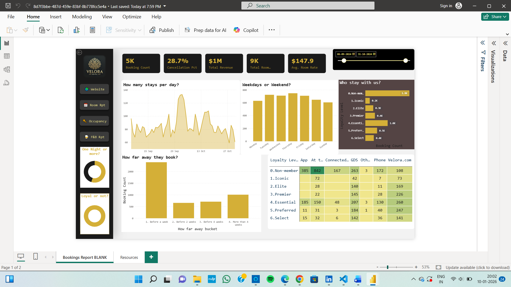
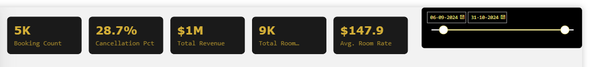
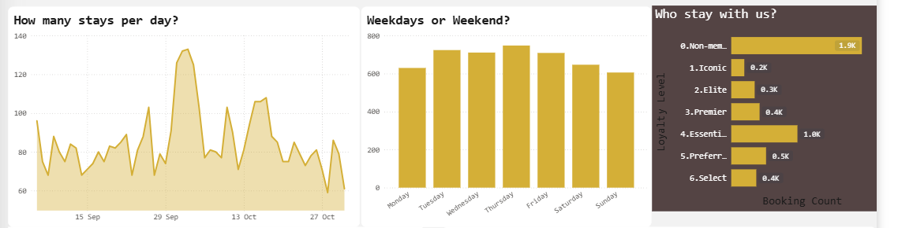
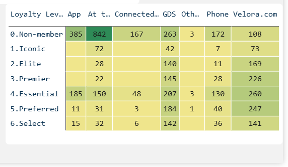

# Hotel Management Dashboard | Power BI

## 📌 Project Overview
This Power BI dashboard analyzes hotel booking data to track bookings,
revenue, cancellations, and customer behavior. It helps hotel management
make data-driven decisions related to pricing, occupancy, and customer loyalty.

## 📊 Key KPIs
- Total Bookings
- Cancellation Percentage
- Total Revenue
- Total Room Nights
- Average Daily Rate (ADR)

## 📈 Dashboard Explanation
- Displays daily booking trends to understand demand patterns
- Compares weekday vs weekend bookings
- Analyzes booking lead time (how far in advance customers book)
- Segments customers based on loyalty levels
- Evaluates booking performance across different channels

## ⚙️ Challenges Faced
- Cleaning raw booking data with missing and inconsistent values
- Creating accurate DAX measures for KPIs and calculations
- Designing a clear and user-friendly dashboard layout
- Managing multiple filters and slicers efficiently

## 🛠 Tools Used
- Power BI
- DAX
- Power Query
- CSV / Excel Dataset

## 📷 Dashboard Preview
### Overall Dashboard

### KPI Summary

### Customer Behavior

### Booking Channel vs Loyalty

## ✅ Conclusion
This dashboard provides actionable insights into hotel performance and
customer behavior, supporting better business and operational decisions.
